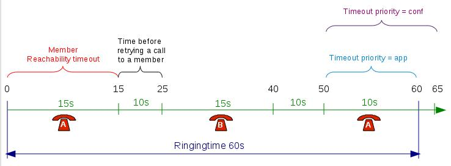

Call queues are used to distribute calls to the agents subscribed to the
queue. Queues are managed with the `/queues` endpoints

A queue can be configured with the following options:

A `options: strategy` defines how queue members are called when a call
enters the queue. A queue can use one of the following ring strategies:

> -   `linear`: For each call, in the same order, starting from the same
>     member
>     -   For agents: In login order
>     -   For static members: In definition order
> -   `leastrecent`: call the member who least recently hung up a call
> -   `fewestcalls`: call the member with the fewest completed calls
> -   `rrmemory` (round robin with memory): call the "next" member
>     after the one who answered last
> -   `random`: call a member at random
> -   `wrandom` (weight random): same as random, but taking the member
>     penalty into account
> -   `ringall`: call all members at the same time
>
> #:warning: When editing a queue, you can't change the ring strategy to linear.
> This is due to an asterisk limitation. Unfortunately, if you want to
> change the ring strategy of a queue to linear, you'll have to delete
> it first and then create a new queue with the right strategy.

> #:exclamation: When an agent is a member of many queues the order of call
> distribution between multiple queues is nondeterministic and cannot be
> configured.

Timers
======

You may control how long a call will stay in a queue using different
timers:

> -   `options: timeout` (Member reachabillity time out): Maximum number
>     of seconds a call will ring on an agent's phone. If a call is not
>     answered within this time, the call will be forwarded to another
>     agent.
> -   `retry_on_timeout` (Time before retrying a call to a member): Used
>     once a call has reached the "Member reachability time out". The
>     call will be put on hold for the number of seconds allowed before
>     being redirected to another agent.
> -   `timeout` (Ringing time): The total time the call will stay in the
>     queue.
> -   `options: timeoutpriority` (Timeout priority): Determines which
>     timeout to use before ending a call. When set to
>     "configuration", the call will use the "Member reachability
>     time out". When set to "dialplan", the call will use the
>     "Ringing time".

Fallbacks
=========

Calls can be diverted on no answer with `/queues/{queue_id}/fallbacks`
endpoints:

-   `noanswer_destination`: The call reached the `timeout` and no agent
    answered the call.
-   `congestion_destination`: The number of calls waiting has reached
    the `options: maxlen`.
-   `fail_destination`: No agent was available to answer the call when
    the call entered the queue (`options: joinempty`) or the call was
    queued and no agents were available to answer
    (`options: leavewhenempty`).

Diversions
==========

Diversions can be used to redirect calls to another destination when a
queue is very busy. Calls are redirected using one of the two threshold:
`wait_ratio_threshold` and `ẁait_time_threshold`

The diversion check is done only once per call, before the
`preprocess subroutine <subroutine>`{.interpreted-text role="ref"} is
executed and before the call enters the queue.

`wait_time_threshold`
---------------------

When this scenario is used, the administrator can set a destination for
calls to be sent to when the estimated waiting time is over the
threshold `wait_time_threshold`.

Note that if a new call arrives when there are no waiting calls in the
queue, the call will **always** be allowed to enter the queue.

#!exclamation:
-   this *estimated* waiting time is computed from the **actual hold
    time** of all **answered** calls in the queue (since last asterisk
    restart) according to an [exponential smoothing
    formula](https://en.wikipedia.org/wiki/Exponential_smoothing)
-   the estimated waiting time of a queue is updated only when a queue
    member answers a call.

`wait_ratio_threshold` {#queue-diversion-waitratio}
----------------------

When this scenario is used, the administrator can set a destination for
calls to be sent to when the number of waiting calls per logged-in agent
is over the `wait_ratio_threshold`.

The number of waiting calls includes the call for which the check is
currently being performed.

The number of logged-in agents is the sum of user members and currently
logged-in agent members. An agent only needs to be logged in and a
member of the queue to participate towards the count of logged-in
agents, regardless of whether he is available, on call, on pause or on
wrapup.

The maximum number of waiting calls per logged-in agent can have a
fractional part.

Here are a few examples:

    wait_ratio_threshold: 1
    Current number of waiting calls: 2
    Current number of logged-in agents: 2
    Number of waiting calls per logged-in agent when a new call arrives: 3 / 2 = 1.5
    Call will be redirected to ``wait_ratio_destination``

    wait_ratio_threshold: 0.5
    Number of waiting calls: 5
    Number of logged-in agents: 12
    Number of waiting calls per logged-in agent when a new call arrives: 6 / 12 = 0.5
    Call will not be redirected to ``wait_ratio_destination``

Note that if a new call arrives when there are no waiting calls in the
queue, the call will **always** be allowed to enter the queue. For
example, in the following scenario:

    wait_ratio_threshold: 0.5
    Current number of waiting calls: 0
    Current number of logged-in agents: 1
    Number of waiting calls per logged-in agent when a new call arrives: 1 / 1 = 1

Even if `wait_ratio_time` (1) is greater than the maximum (0.5), the
call will still be accepted since there are currently no waiting calls.

Music on Hold
=============

The `music_on_hold` of the queue will be played:

-   When the caller is waiting to be answered.
-   When the caller is put on hold by an agent who already answered.

If you want a different music to be played when the caller is put on
hold after being answered, you need to make some more configuration:

1.  Write an AGI script that will set the channel variable
    `CHANNEL(musicclass)` to the name of the music-on-hold class you
    want the caller to hear when he is put on hold by the agent. Save
    this script to e.g. `/usr/local/bin/agi-agent-hold-moh`.
2.  Add the following
    `preprocess subroutine <subroutine>`{.interpreted-text role="ref"}
    on the queue:

        [setup-agent-hold-moh]
        exten = s,1,NoOp(Setting AGI script for custom agent hold music)
        same  =   n,Set(XIVO_QUEUEAGI=/usr/local/bin/agi-agent-hold-moh)
        same  =   n,Return

This configuration will give the following scenario:

-   The caller calls the queue
-   The caller hears the music on hold of the queue
-   The agent answers the call
-   Wazo calls the AGI script, setting the new music on hold
-   The caller and the agent talk together
-   The agent puts the caller on hold
-   The caller hears the new music on hold, set by the AGI script
