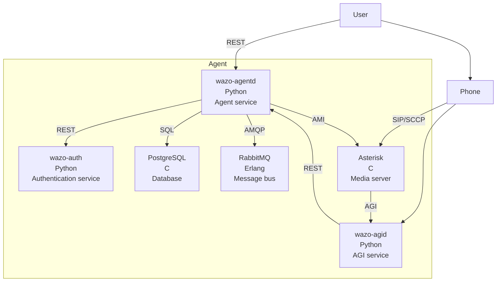
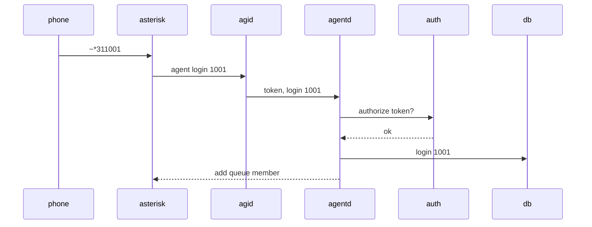

[wazo-agentd](https://github.com/wazo-platform/wazo-agentd) is the service responsible of managing agent which are used to distribute calls received on queues in a call center use case.

It can do the following actions:

- log in
- log out
- pause
- resume

## Schema

## Example

## API documentation

The REST API for wazo-agentd is available [here](../api/agent.html)

## Related

- [wazo-auth](authentication.html)

## See also

- [Dev notes](agent-core.html)
