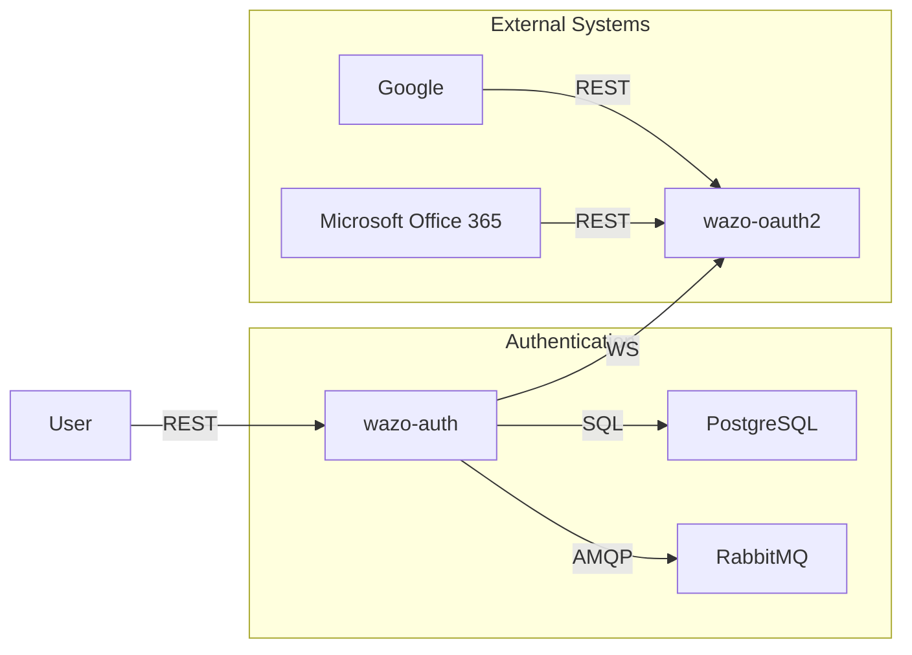
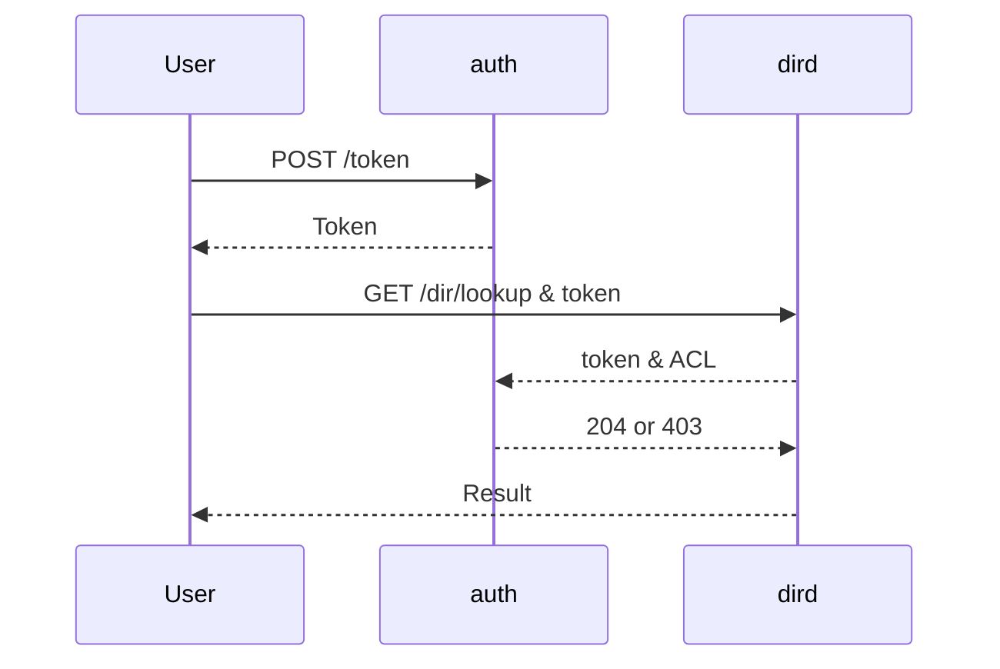

[wazo-auth](https://github.com/wazo-platform/wazo-auth) is the authentication server used by the Wazo platform.

It is used to:

- create and store tokens
- validate tokens and permissions
- create and manage users
- create and manage user groups
- create and manage policies (named group of permissions).
- bootstrap third party authentication for Microsoft and Google
- store tokens for Google and Microsoft
- handle SAML authentication

## Schema

- wazo-oauth2 is used to complete the OAuth 2.0 token creation process for third party authentications

## Example

## API documentation

The REST API for wazo-auth is available [here](../api/authentication.html).

The bus events are defined [here](https://github.com/wazo-platform/wazo-bus/blob/master/wazo_bus/resources/auth/events.py).

The database tables are defined [here](https://github.com/wazo-platform/wazo-auth/blob/master/wazo_auth/database/models.py).

The SAML based login is available using SAML wazo-auth APIs, more details are available in its [documentation](../api/authentication.html).
To be able to use it you need to install the federation metadata XML file and add the corresponding configuration file. Please check
the example in the wazo-auth [sources](https://github.com/wazo-platform/wazo-auth/blob/master/etc/wazo-auth/config.yml).

## Policies

A policy is a list of access that is used to access Wazo resources.
Policies can be created, deleted or modified using the REST API.

## Tokens

A token is used to identify and authorize all HTTP queries done on the wazo-platform. Each token has an expiration
and can be revoked by the user.

The token should be added to each subsequent HTTP request using the 'X-Auth-Token' HTTP header.

## Service Authentication

Wazo services expose more and more resources through REST API, but they also ensure that the access
is restricted to the authorized programs.

### Call flow

Here is the call flow to access a REST resource of a Wazo service:

1. Create a username/password (also called service_id/service_key) with the right ACL.
2. Create a token with these credentials.
3. Use this token to access the REST resource requiring the ACL

add a schema here https://wazo.readthedocs.io/en/latest/_images/service_authentication_workflow.png

- Service: Service who needs to access a REST resource.
- wazo-\{daemon\}: Server that exposes a REST resource. This resource must have a required ACL.
- wazo-auth: Server that authenticates the `Service` and validates the required ACL with the token.

Wazo services directly use this system to communicate with each other, as you can see in their Web
Services Access.

## See also

- [Admin notes](authentication-admin.html)
- [Dev notes](authentication-admin.html)
