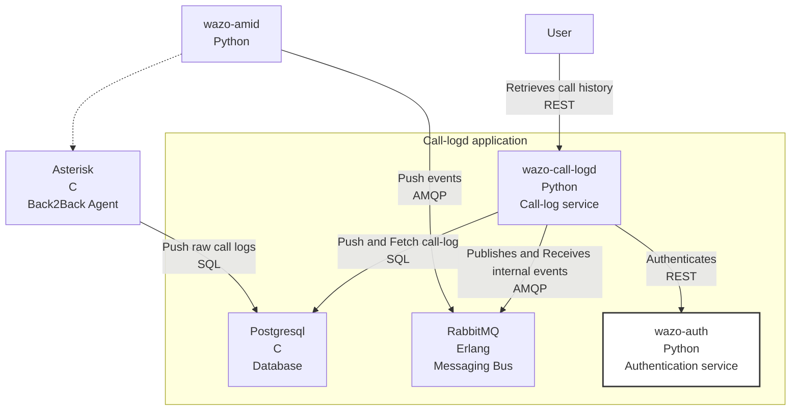
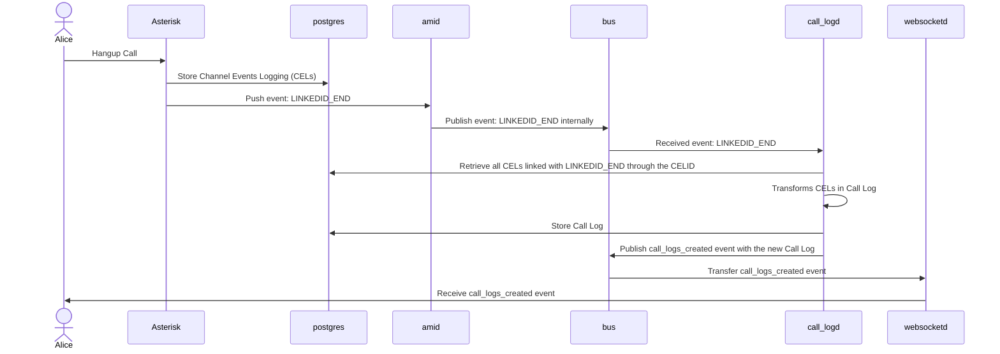

[wazo-call-logd](https://github.com/wazo-platform/wazo-call-logd) collects metadata on calls made on a Wazo Platform, allowing users to see their calls history.

This is service accessible via REST API.

## Schema



## Usage example



## API documentation

The REST API for wazo-call-logd is available [here](../api/cdr.html)

## Related

- [wazo-auth](https://github.com/wazo-platform/wazo-auth)

## See also

- [Admin notes](cdr-admin.html)

```

```
