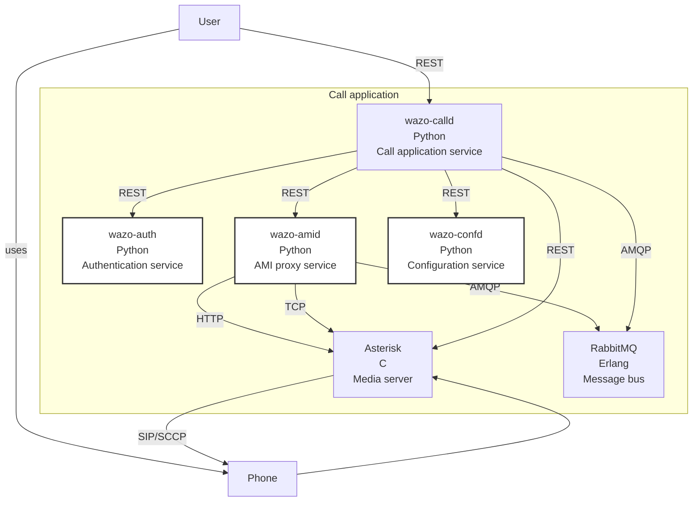
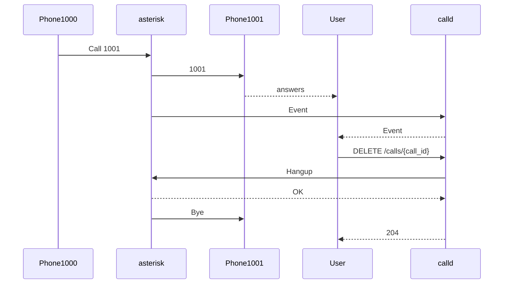

[wazo-calld](https://github.com/wazo-platform/wazo-calld) is the call control service for the Wazo platform.

It manages the following resources:

- applications
- calls
- fax
- relocates
- switchboards
- transfers
- voicemails

## API documentation

The REST API for wazo-calld is available [here](../api/application.html#tag/applications).

The bus events are defined [here](https://github.com/wazo-platform/wazo-calld/blob/master/wazo_calld/plugins/calls/events.yml) and [here](https://github.com/wazo-platform/wazo-calld/blob/master/wazo_calld/plugins/switchboards/events.yml).

## Schema

## Example

## Related

- [wazo-amid](amid.html)
- [wazo-auth](authentication.html)
- [wazo-confd](configuration.html)

## See also

- [Dev notes](application-dev.html)
