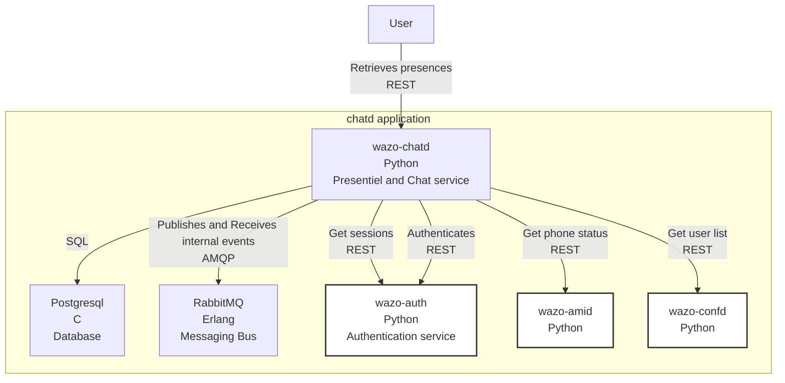
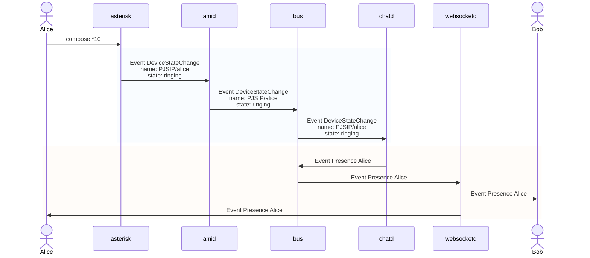
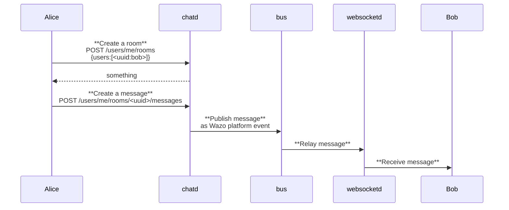

[wazo-chatd](https://github.com/wazo-platform/xivo-chatd) adds messaging functionality as well as devices and users presence for a Wazo Platform.

This is service accessible via REST API.

## Schema

## Usage example

## API documentation

The REST API for wazo-chatd is available [here](../api/chat.html)

## Related

- [wazo-amid](https://github.com/wazo-platform/wazo-amid)
- [wazo-confd](configuration.html)
