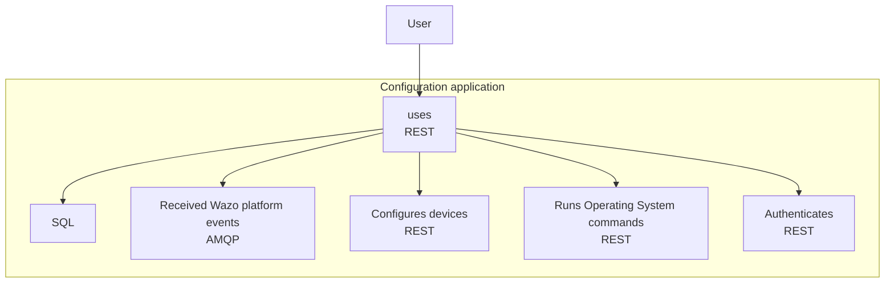
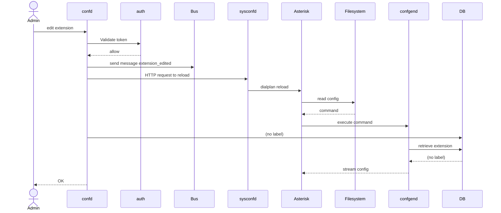
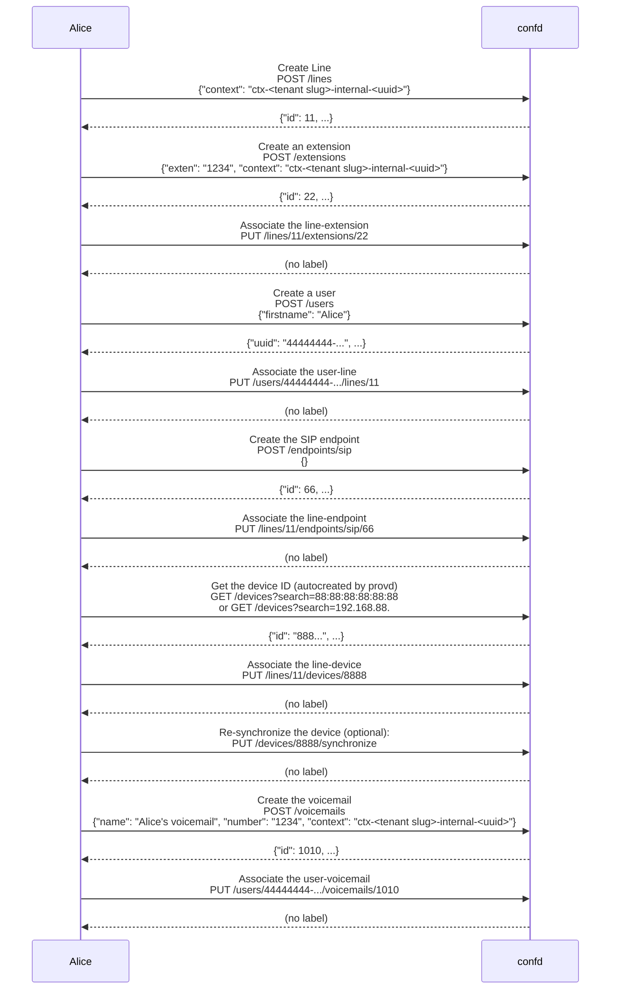

[wazo-confd](https://github.com/wazo-platform/wazo-confd) configures and manages the PBX part of Wazo Platform.

- Agents
- Applications
- Asterisk configuration
- Call filters
- Call permissions
- Call pickups
- Conferences
- Configuration
- Contexts
- DHCP
- Devices
- Endpoints custom
- Endpoints iax
- Endpoints sccp
- Endpoints sip
- Extensions
- Function keys
- Groups
- High availability
- IVR
- Incoming calls
- Lines
- Music on hold
- Outgoing calls
- Pagings
- Parking lots
- Queues skills
- Queues
- Registers
- Sounds
- Switchboards
- Trunks
- Users
- Voicemails

## Schema

## First example

## Second example: Create a user with a phone and a voicemail

Setup workflow, details to create resources as described afterward:

- First, associate a `line` to an `extension ;
- Then, associate an `user` to the `line` ;
- Then associate an `endpoint` with the `line` ;
- Then associate a `device` with the `line` ;
- Finally, associate `voicemail` to the `user`.

## API documentation

The REST API for wazo-confd is available [here](../api/configuration.html)

## Related

- [wazo-auth](https://github.com/wazo-platform/wazo-auth)
- [wazo-confd-client](https://github.com/wazo-platform/wazo-confd-client)
- [wazo-provd](https://github.com/wazo-platform/wazo-provd)
- [wazo-sysconfd](https://github.com/wazo-platform/wazo-sysconfd)

## See also

- [Internal concepts](/uc-doc/system/wazo-confd/developer)
- [Tools](https://github.com/wazo-platform/wazo-confd/blob/master/README.md)
