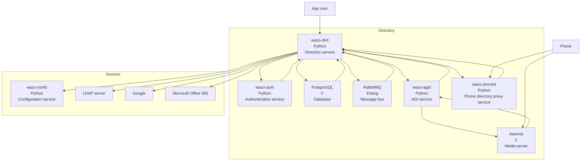
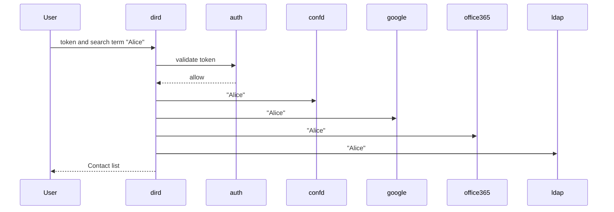

[wazo-dird](https://github.com/wazo-platform/wazo-dird) is the directory server for Wazo. It offers a simple REST interface to query all directories that are configured.

View capabilities:

- default_json: present directory entries in JSON format
- headers: List headers that will be available in results from `default_json` view
- personal: Expose REST API to manage personal contacts
- phonebook: Expose REST API to manage wazo-dird’s internal phonebooks.
- aastra: Expose REST API to search in configured directories for Aastra phone.
- cisco: Expose REST API to search in configured directories for Cisco phone
- polycom: Expose REST API to search in configured directories for Polycom phone.
- snom: Expose REST API to search in configured directories for Snom phone.
- thomson: Expose REST API to search in configured directories for Thomson phone.
- yealink: Expose REST API to search in configured directories for Yealink phone.

Backend capabilities:

- CSV: read directory entries from a CSV file.
- CSV Web Service: search using a web service that returns CSV formatted results.
- Phonebook: search the wazo-dird’s internal phonebooks
- LDAP: search directory entries from an LDAP server.
- Personal: Add search results from the user personal contacts
- Wazo: add users from wazo-confd as directory entries
- Conference: add conferences from wazo-confd as directory entries
- Google: add the user's personal Google contacts as directory entries
- Office365: add the user's personal Office365 contacts as directory entries

## Schema

- wazo-phoned is a service that act as a proxy for phones and verify that the IP address of the phone is allowed to do a directory search before doing the HTTP request on dird on behalf of the phone.

## Example

## API documentation

The REST API for wazo-dird is available [here](../api/contact.html)

The database tables are defined [here](https://github.com/wazo-platform/wazo-dird/blob/master/wazo_dird/database/models.py)

The database is used to store:

- Personal contacts for each user
- Phonebook entries
- source and ID for favorites contacts
- directory source configuration
- directory profile configuration

## Related

- [wazo-auth](authentication.html)
- [wazo-confd](configuration.html)

## See also

- [Glossary](contact-glossary.html)
