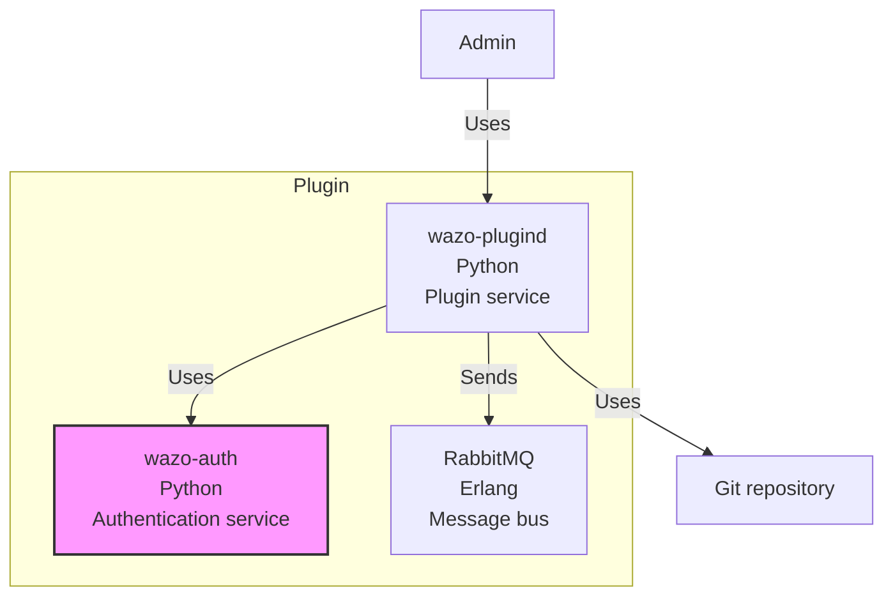
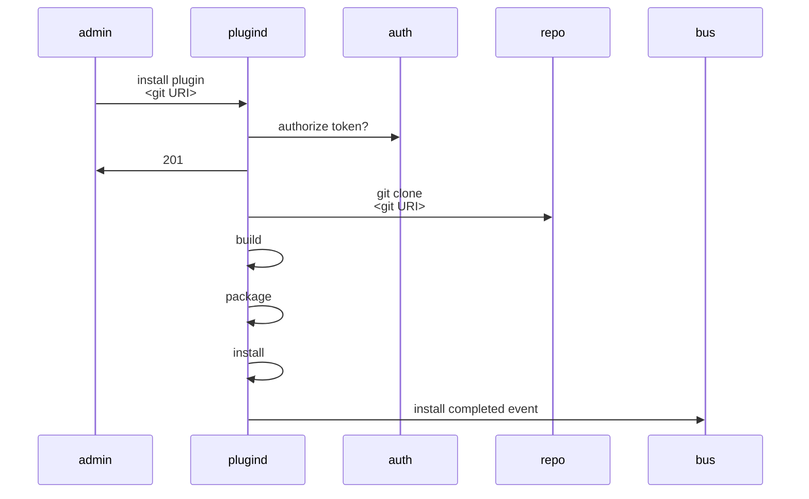

[wazo-plugind](https://github.com/wazo-platform/wazo-plugind) is a service to manage plugins in the Wazo Platform.

It allows the administrator to manage plugins installed on a Wazo Platform using a simple HTTP interface.

It can:

- list available plugins
- install plugins
- uninstall plugins
- list installed plugins
- update plugins

## Schema

## Example

## API documentation

The REST API for wazo-plugind is available [here](../api/plugins.html).

The bus events are defined [here](https://github.com/wazo-platform/wazo-bus/blob/master/wazo_bus/resources/plugins/events.py).

## What is a plugin

A plugin is a set of additions made to a custom Wazo platform installation to add a new functionality.

### What can be done with a plugin

Wazo plugins allow a third party to add almost anything to Wazo. Most of our services have extension points that can be used together to create a complete feature as a plugin.

- Add configuration files to wazo services in /etc/\*/conf.d/
- Add configuration files and dialplan files to Asterisk
- Reload services to complete the installation
- Extend wazo services using the available extension points

  - wazo-auth
  - wazo-calld
  - wazo-confd
  - wazo-dird
  - wazo-confgend

## How it works

Given a plugin source wazo-plugind will generate a debian package using the information provided in the `wazo` directory.

The `plugin.yml` adds data that can be used to generate the debian packaging files.
The `rules` file is used to add actions during the installation and uninstallation process.

The generated Debian packages have the following names `wazo-plugind-<plugin name>-<plugin namespace>`

## Related

[wazo-auth](authentication.html)

## See also

- [Admin notes](plugins-admin.html)
