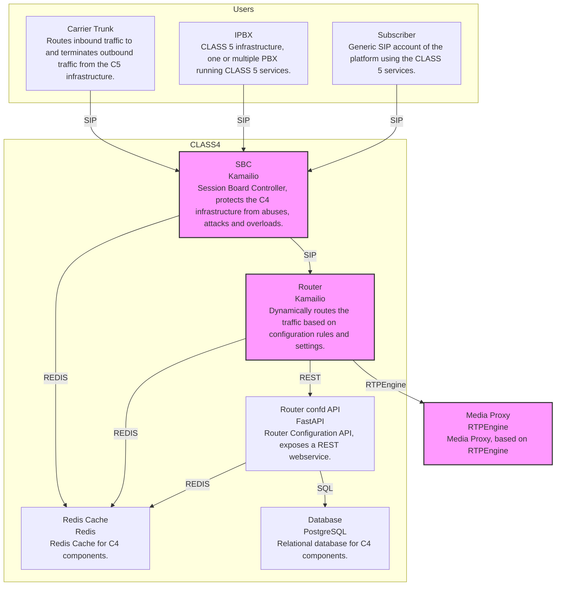

[wazo-router-confd](https://github.com/wazo-platform/wazo-router-confd) is the configuration, management, and routing API server of the Wazo Platform C4 (Class 4).

- Carrier and Carrier Trunks
- CDR
- DIDs
- Domains
- IPBX
- Normalization profiles and rules
- Routing groups and rules
- Tenants

It exposes the end-points used by the Wazo Router as well.

## Schema

## Part of the Wazo Platform C4

A Class 4 Softswitch routes large volumes of usually long-distance VoIP calls. For businesses that want to interconnect their VoIP servers, a Class 4 Softswitch is used to relay VoIP traffic and services over multiple IP networks. C4 soft switches provide intelligent call routing, which reduces congestion, latency, and costs while improving the quality of VoIP calls. They have several security features to protect the C5 switches.

The main characteristics of a C4 Softswitch are:

- route large volume of calls
- protocol support and conversion
- transcoding
- billing interface
- security management
- call authentication
- call authorization

Wazo Platform aims to offer to service providers, enterprises, and digital natives a coherent and complete reference platform for the design, deployment, and management of a telecom infrastructure that can support massive volumes of simultaneous calls by interconnecting millions of users.

The solution must be able to handle mission-critical needs by providing robust and efficient mechanisms for availability and scalability.

## API documentation

The REST API for wazo-router-confd is available [here](../api/router-confd.html)

## Related

- [wazo-c4-sbc](c4-sbc.html)
- [wazo-c4-router](c4-router.html)
- [wazo-rtpe](rtpe-config.html)
