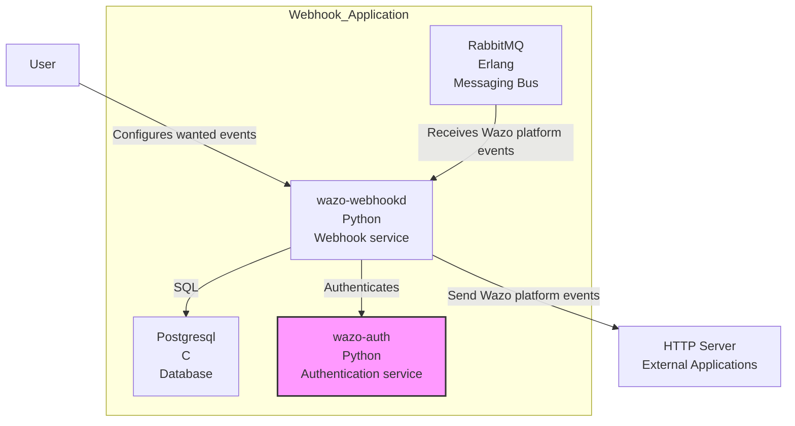
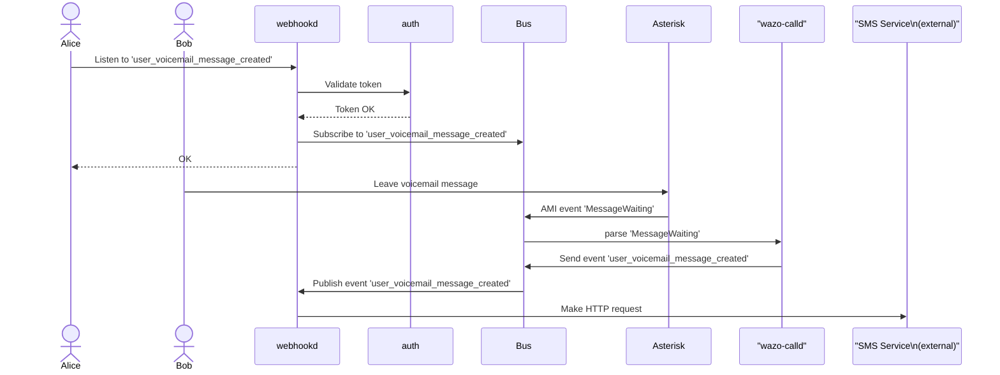

[wazo-webhookd](https://github.com/wazo-platform/wazo-webhookd) connects to Wazo Platform event bus to push custom HTTP hooks to external
system.

It manages the list of webhooks and triggers them when an event occurs.

Configurable via REST API.

## Schema

## Example

## API documentation

The REST API for wazo-webhookd is available [here](../api/webhook.html)

## See also

- [Dev notes](webhook-core.html)
