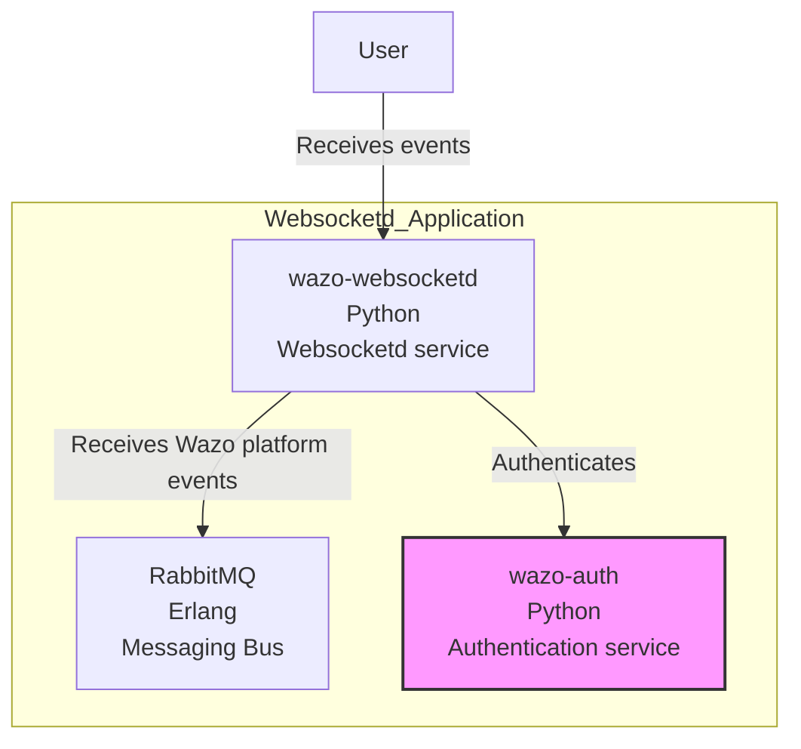
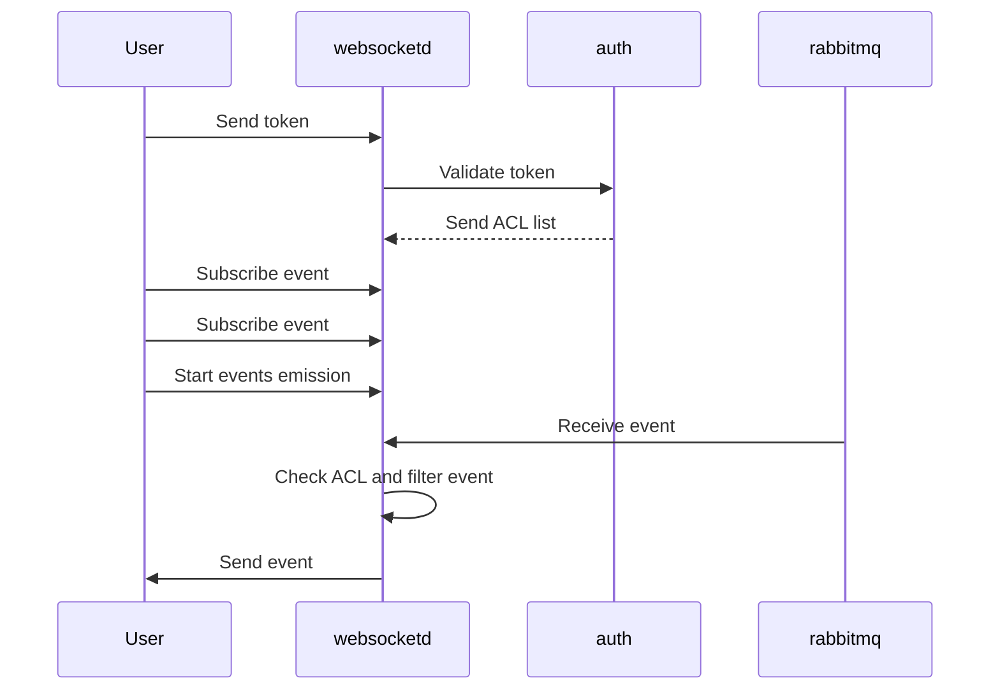

[wazo-websocketd](https://github.com/wazo-platform/wazo-websocketd) is a WebSocket server that delivers Wazo Platform related events to clients.

This makes it easier to build dynamic web applications that are using events from Wazo.

## Schema

## Usage example

## See also

- [Dev notes](websocket-app.html)
