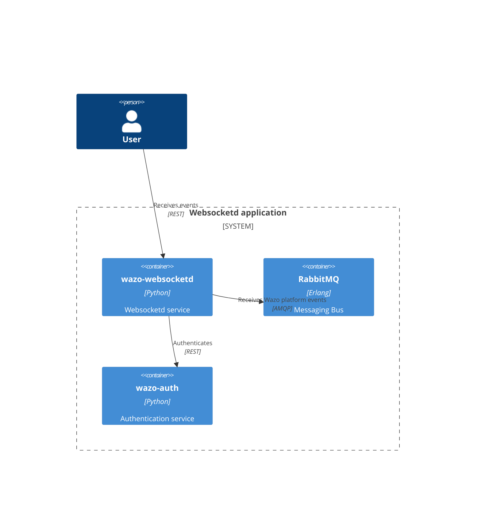
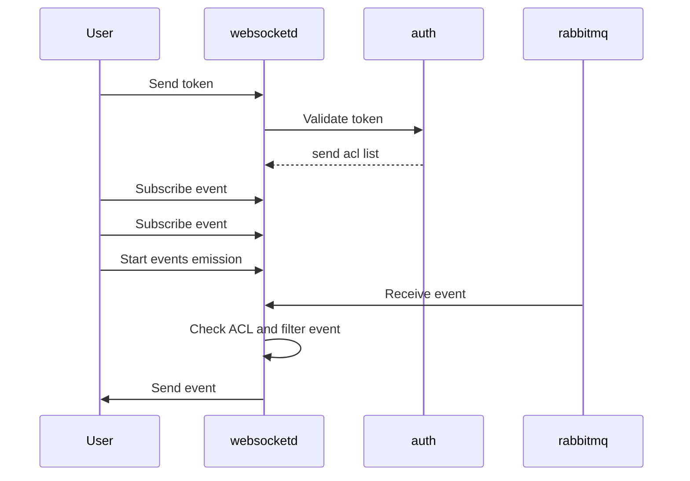

# [`websocketd`](https://github.com/wazo-platform/wazo-websocketd)

WebSocket server that delivers Wazo Platform-related events to clients.

This ease in building dynamic web applications that are using events from your Wazo.

## Schema

## Usage example

## See also

* [Dev notes](websocket-app.html)
