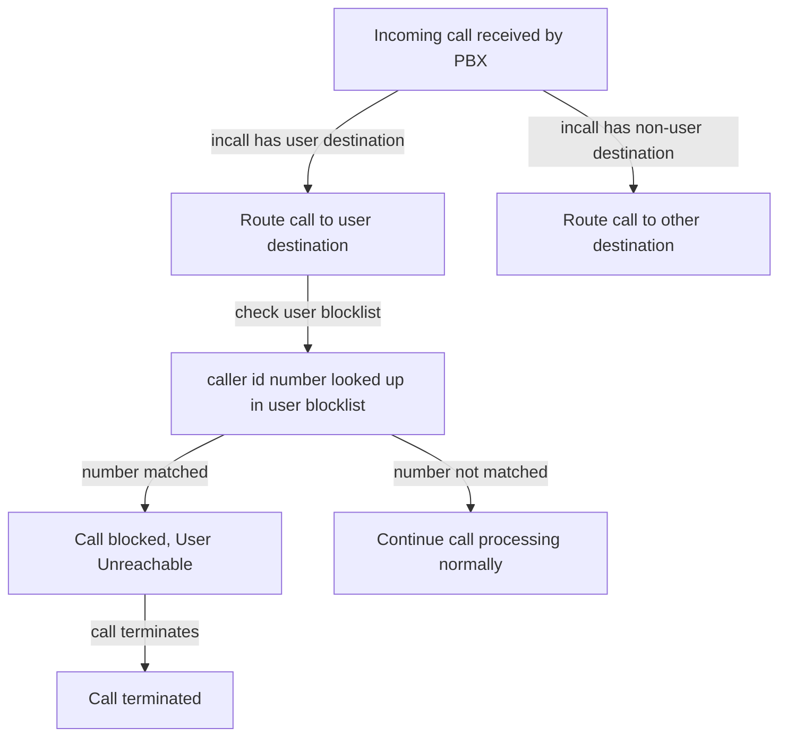

The user blocklist feature allows wazo-platform users to maintain a list of phone numbers that
should be used to screen external incoming calls and block unwanted callers, such as telemarketers,
spammers or harassers.

User blocklists are only used to screen incoming calls destined directly to users(i.e. calls handled
through an incall configured with a user destination), and are not used to screen _internal_ calls.

Here's a flow diagram describing how the blocklist feature impacts the call flow:



## Managing a blocklist

An end-user of a wazo-platform deployment can manage their blocklist through the
[wazo-confd](/uc-doc/administration/wazo_confd) end-user APIs:

- [listing one's blocklist](/documentation/api/configuration.html#tag/blocklist/operation/list_users_me_blocklist_numbers):
  ```bash
  curl -H "X-Auth-Token: $token" -H "Wazo-Tenant: $tenant_uuid" https://<stack hostname>/api/confd/1.1/users/me/blocklist/numbers
  ```
- [adding an entry to one's blocklist](/documentation/api/configuration.html#tag/blocklist/operation/create_users_me_blocklist_number):
  ```bash
  curl -H "X-Auth-Token: $token" -H "Wazo-Tenant: $tenant_uuid" -XPOST https://<stack hostname>/api/confd/1.1/users/me/blocklist/numbers
  ```
- [removing an entry from one's blocklist](/documentation/api/configuration.html#tag/blocklist/operation/delete_users_me_blocklist_number):
  ```bash
  curl -H "X-Auth-Token: $token" -H "Wazo-Tenant: $tenant_uuid" -XDELETE https://<stack hostname>/api/confd/1.1/users/me/blocklist/numbers/$blocklist_number_uuid
  ```
- [updating an entry in one's blocklist](/documentation/api/configuration.html#tag/blocklist/operation/update_users_me_blocklist_number):
  ```bash
  curl -H "X-Auth-Token: $token" -H "Wazo-Tenant: $tenant_uuid" -XPUT https://<stack hostname>/api/confd/1.1/users/me/blocklist/numbers/$blocklist_number_uuid
  ```

These APIs require `confd.users.me.blocklist` permissions that are part of the default Wazo user
policy.

## Administrator oversight

Wazo-Platform administrator users have access to read-only APIs in wazo-confd to consult the numbers
blocklisted by users:

- [looking up a number in a user's blocklist](/documentation/api/configuration.html#tag/blocklist/operation/lookup_users_blocklist_number):
  ```bash
  curl -H "X-Auth-Token: $token" -H "Wazo-Tenant: $tenant_uuid" -I "https://<stack hostname>/api/confd/1.1/users/{user_uuid}/blocklist/numbers?number_exact=$number"
  ```
- [listing & searching through all blocklisted numbers](/documentation/api/configuration.html#tag/blocklist/operation/list_blocklist_numbers):
  ```bash
  curl -H "X-Auth-Token: $token" -H "Wazo-Tenant: $tenant_uuid" "https://<stack hostname>/api/confd/1.1/users/blocklist/numbers?user_uuid=$user_uuid&number=$number&label=$label"
  ```

These APIs require `confd.users.blocklist` permissions that are part of the default Wazo admin
policy.

## Configurations affecting blocklist screening

Blocklist call screening relies on matching the caller id number of an incoming call to numbers in
users blocklists. Numbers specified in user blocklists are restricted to
["+E.164" format](https://www.itu.int/rec/T-REC-E.164/en). During blocklist screening, incoming
caller id numbers must be interpreted and normalized into E.164 format in order to perform a lookup
and detect a match.

Two configurations may affect the processing of the caller id number and blocklist screening:

- [`in_callerid` normalisation rules](/uc-doc/installation/postinstall#callerid-num-normalization):
  these normalization rules may transform an incoming caller id number into different formats,
  including ambiguous locale-specific formats;
- [wazo-confd tenant localization](/uc-doc/administration/localization): this API provides explicit
  per-tenant geographical context information which may be used by Wazo-Platform subsystems for
  interpretation and normalization of locale-dependent information, such as phone numbers.

Both configuration elements must be consistent for blocklist screening to be reliable(i.e. avoid
false negatives or false positives).

For example, if `in_callerid` rules produce caller id numbers in a specific national format(e.g.
`01 23 45 67 89` french national format), then the tenant's localization must be correspondingly set
to the country of that national format, in order for such a number to be unambiguously interpreted.

If `in_callerid` rules are such as to produce only +E.164 caller id numbers, then the caller id
number would remain unambiguous irrespective of the tenant's localization.

## Debugging

In the presence of call issues which are suspected to be related to user blocklist screening, a few
steps may be taken to investigate and verify the impact of blocklist screening.

- Checking asterisk logs should show whether the blocklist dialplan was invoked, and whether the
  call was blocked or not;
- Checking the wazo-agid logs should inform on the processing of the `screen_blocklist` AGI; in
  debug mode, the logs will show the caller id number being looked up, the user uuid, if the number
  is matched in the user's blocklist, and the uuid of the blocklist entry if a match was found;
- Checking the wazo-confd logs should inform on the usage of the blocklist APIs; in debug mode, the
  logs should show the API calls to the blocklist lookup API endpoint
  `/users/{user_uuid}/blocklist/numbers`, and whether the lookup is a successful match(204 response)
  or not(404 response);
- Using the wazo-confd admin APIs `/users/{user_uuid}/blocklist/numbers` or
  `/users/blocklist/numbers?user_uuid={user_uuid}` to read a user's blocklist; this should reveal
  the blocklist entries that are currently active for the user; note that the numbers in the
  blocklist are always formatted in +E.164, while an incoming caller id numbers may not be, and
  needs to be interpreted and normalized by the `screen_blocklist` AGI when looking it up.

### Asterisk logs

Here's an example extract from asterisk logs showing part of the dialplan trace during an incall,
where the caller id number is blocked by the user's blocklist:

```
[2025-04-30 20:24:49.3873] VERBOSE[956005][C-00000015] pbx.c: Executing [s@user:40] GotoIf("PJSIP/32x6q6kv-0000002b", "1?:no_block") in new stack
[2025-04-30 20:24:49.3873] VERBOSE[956005][C-00000015] pbx.c: Executing [s@user:41] AGI("PJSIP/32x6q6kv-0000002b", "agi://127.0.0.1/screen_blocklist,81ea4378-1647-4eae-ad83-26178bdc2890") in new stack
[2025-04-30 20:24:49.3874] VERBOSE[956005][C-00000015] res_agi.c: AGI Tx >> agi_network: yes
[2025-04-30 20:24:49.3874] VERBOSE[956005][C-00000015] res_agi.c: AGI Tx >> agi_network_script: screen_blocklist
[2025-04-30 20:24:49.3875] VERBOSE[956005][C-00000015] res_agi.c: <PJSIP/32x6q6kv-0000002b>AGI Tx >> agi_request: agi://127.0.0.1/screen_blocklist
[2025-04-30 20:24:49.3875] VERBOSE[956005][C-00000015] res_agi.c: <PJSIP/32x6q6kv-0000002b>AGI Tx >> agi_channel: PJSIP/32x6q6kv-0000002b
[2025-04-30 20:24:49.3875] VERBOSE[956005][C-00000015] res_agi.c: <PJSIP/32x6q6kv-0000002b>AGI Tx >> agi_language: en_US
[2025-04-30 20:24:49.3875] VERBOSE[956005][C-00000015] res_agi.c: <PJSIP/32x6q6kv-0000002b>AGI Tx >> agi_type: PJSIP
[2025-04-30 20:24:49.3875] VERBOSE[956005][C-00000015] res_agi.c: <PJSIP/32x6q6kv-0000002b>AGI Tx >> agi_uniqueid: 1746044688.69
[2025-04-30 20:24:49.3875] VERBOSE[956005][C-00000015] res_agi.c: <PJSIP/32x6q6kv-0000002b>AGI Tx >> agi_version: 22.2.0-1~wazo7.deb11
[2025-04-30 20:24:49.3875] VERBOSE[956005][C-00000015] res_agi.c: <PJSIP/32x6q6kv-0000002b>AGI Tx >> agi_callerid: 5145552255
[2025-04-30 20:24:49.3875] VERBOSE[956005][C-00000015] res_agi.c: <PJSIP/32x6q6kv-0000002b>AGI Tx >> agi_calleridname: Wazo-Test  - Test
[2025-04-30 20:24:49.3875] VERBOSE[956005][C-00000015] res_agi.c: <PJSIP/32x6q6kv-0000002b>AGI Tx >> agi_callingpres: 3
[2025-04-30 20:24:49.3875] VERBOSE[956005][C-00000015] res_agi.c: <PJSIP/32x6q6kv-0000002b>AGI Tx >> agi_callingani2: 0
[2025-04-30 20:24:49.3875] VERBOSE[956005][C-00000015] res_agi.c: <PJSIP/32x6q6kv-0000002b>AGI Tx >> agi_callington: 0
[2025-04-30 20:24:49.3875] VERBOSE[956005][C-00000015] res_agi.c: <PJSIP/32x6q6kv-0000002b>AGI Tx >> agi_callingtns: 0
[2025-04-30 20:24:49.3875] VERBOSE[956005][C-00000015] res_agi.c: <PJSIP/32x6q6kv-0000002b>AGI Tx >> agi_dnid: 1002
[2025-04-30 20:24:49.3875] VERBOSE[956005][C-00000015] res_agi.c: <PJSIP/32x6q6kv-0000002b>AGI Tx >> agi_rdnis: unknown
[2025-04-30 20:24:49.3875] VERBOSE[956005][C-00000015] res_agi.c: <PJSIP/32x6q6kv-0000002b>AGI Tx >> agi_context: user
[2025-04-30 20:24:49.3875] VERBOSE[956005][C-00000015] res_agi.c: <PJSIP/32x6q6kv-0000002b>AGI Tx >> agi_extension: s
[2025-04-30 20:24:49.3875] VERBOSE[956005][C-00000015] res_agi.c: <PJSIP/32x6q6kv-0000002b>AGI Tx >> agi_priority: 41
[2025-04-30 20:24:49.3876] VERBOSE[956005][C-00000015] res_agi.c: <PJSIP/32x6q6kv-0000002b>AGI Tx >> agi_enhanced: 0.0
[2025-04-30 20:24:49.3876] VERBOSE[956005][C-00000015] res_agi.c: <PJSIP/32x6q6kv-0000002b>AGI Tx >> agi_accountcode:
[2025-04-30 20:24:49.3876] VERBOSE[956005][C-00000015] res_agi.c: <PJSIP/32x6q6kv-0000002b>AGI Tx >> agi_threadid: 140202580211456
[2025-04-30 20:24:49.3876] VERBOSE[956005][C-00000015] res_agi.c: <PJSIP/32x6q6kv-0000002b>AGI Tx >> agi_arg_1: 81ea4378-1647-4eae-ad83-26178bdc2890
[2025-04-30 20:24:49.3876] VERBOSE[956005][C-00000015] res_agi.c: <PJSIP/32x6q6kv-0000002b>AGI Tx >>
[2025-04-30 20:24:49.4000] VERBOSE[956005][C-00000015] res_agi.c: <PJSIP/32x6q6kv-0000002b>AGI Rx << GET VARIABLE "CALLERID(num)"
[2025-04-30 20:24:49.4000] VERBOSE[956005][C-00000015] res_agi.c: <PJSIP/32x6q6kv-0000002b>AGI Tx >> 200 result=1 (5145552255)
[2025-04-30 20:24:49.4234] VERBOSE[956005][C-00000015] res_agi.c: <PJSIP/32x6q6kv-0000002b>AGI Rx << SET VARIABLE "WAZO_BLOCKED_NUMBER_UUID" "2d76d3a5-d41a-498a-abed-bce30b602693"
[2025-04-30 20:24:49.4236] VERBOSE[956005][C-00000015] res_agi.c: <PJSIP/32x6q6kv-0000002b>AGI Tx >> 200 result=1
[2025-04-30 20:24:49.4245] VERBOSE[956005][C-00000015] res_agi.c: <PJSIP/32x6q6kv-0000002b>AGI Rx << VERBOSE "AGI handler 'screen_blocklist' successfully executed" 1
[2025-04-30 20:24:49.4245] VERBOSE[956005][C-00000015] res_agi.c: agi://127.0.0.1/screen_blocklist,81ea4378-1647-4eae-ad83-26178bdc2890: AGI handler 'screen_blocklist' successfully executed
[2025-04-30 20:24:49.4245] VERBOSE[956005][C-00000015] res_agi.c: <PJSIP/32x6q6kv-0000002b>AGI Tx >> 200 result=1
[2025-04-30 20:24:49.4266] VERBOSE[956005][C-00000015] res_agi.c: <PJSIP/32x6q6kv-0000002b>AGI Script agi://127.0.0.1/screen_blocklist completed, returning 0
[2025-04-30 20:24:49.4268] VERBOSE[956005][C-00000015] pbx.c: Executing [s@user:42] GotoIf("PJSIP/32x6q6kv-0000002b", "2d76d3a5-d41a-498a-abed-bce30b602693?blocked,1") in new stack
[2025-04-30 20:24:49.4268] VERBOSE[956005][C-00000015] pbx_builtins.c: Goto (user,blocked,1)
[2025-04-30 20:24:49.4268] VERBOSE[956005][C-00000015] pbx.c: Executing [blocked@user:1] NoOp("PJSIP/32x6q6kv-0000002b", "Blocked call from caller id number 5145552255") in new stack
[2025-04-30 20:24:49.4269] VERBOSE[956005][C-00000015] pbx.c: Executing [blocked@user:2] CELGenUserEvent("PJSIP/32x6q6kv-0000002b", "WAZO_USER_BLOCKED_CALL,blocked_caller_id_num: 5145552255, blocked_caller_id_nam
e: Wazo-Test  - Test, destination_user_uuid: 81ea4378-1647-4eae-ad83-26178bdc2890, blocked_number_uuid: 2d76d3a5-d41a-498a-abed-bce30b602693") in new stack
[2025-04-30 20:24:49.4270] VERBOSE[956005][C-00000015] pbx.c: Executing [blocked@user:3] Playback("PJSIP/32x6q6kv-0000002b", "user-unreachable") in new stack
[2025-04-30 20:24:49.4313] VERBOSE[182489] res_rtp_asterisk.c: 0x56006089e000 -- Strict RTP learning after remote address set to: 172.16.43.150:16938
[2025-04-30 20:24:49.5424] VERBOSE[956005][C-00000015] res_rtp_asterisk.c: 0x56006089e000 -- Strict RTP qualifying stream type: audio
[2025-04-30 20:24:49.6124] VERBOSE[956005][C-00000015] res_rtp_asterisk.c: 0x56006089e000 -- Strict RTP switching source address to 172.16.43.150:46087
[2025-04-30 20:24:49.6192] VERBOSE[956005][C-00000015] file.c: <PJSIP/32x6q6kv-0000002b> Playing 'user-unreachable.slin' (language 'en_US')
[2025-04-30 20:24:49.7144] VERBOSE[956005][C-00000015] res_rtp_asterisk.c: 0x56006089e000 -- Strict RTP switching to RTP target address 172.16.43.150:16938 as source
[2025-04-30 20:24:54.4541] VERBOSE[956005][C-00000015] res_rtp_asterisk.c: 0x56006089e000 -- Strict RTP learning complete - Locking on source address 172.16.43.150:16938
[2025-04-30 20:24:54.8120] VERBOSE[956005][C-00000015] pbx.c: Executing [blocked@user:4] Hangup("PJSIP/32x6q6kv-0000002b", "") in new stack
[2025-04-30 20:24:54.8123] VERBOSE[956005][C-00000015] pbx.c: Spawn extension (user, blocked, 4) exited non-zero on 'PJSIP/32x6q6kv-0000002b'
```

- `s@user:40`: the dialplan checks whether to invoke blocklist screening, and does so as this is an
  external call;
- `s@user:41`: the `screen_blocklist` AGI is invoked;  
  the caller id number is found in the user's blocklist, as indicated by the
  `WAZO_BLOCKED_NUMBER_UUID` variable being set to the identifier of the blocklist entry;
- `s@user:42`,`blocked@user:1`, `blocked@user:2`, `blocked@user:3`: the call is redirected to
  dialplan handling blocked calls, notifying the caller that the user is unreachable;
- `blocked@user:4`: the call is terminated.

### wazo-agid logs

Example logs showing wazo-agid processing an invocation of the `screen_blocklist` AGI, involving a
successful lookup of the caller id number in a user's blocklist:

```
2025-04-28 15:40:52,508 [193093] (DEBUG) (wazo_agid.agid): delegating request handling 'screen_blocklist'
2025-04-28 15:40:52,530 [193093] (DEBUG) (wazo_agid.modules.screen_blocklist): screening caller id number 5145552255 calling user 81ea4378-1647-4eae-ad83-26178bdc2890(country=CA)
2025-04-28 15:40:52,532 [193093] (DEBUG) (wazo_agid.modules.screen_blocklist): looking up number +15145552255 in blocklist of user 81ea4378-1647-4eae-ad83-26178bdc2890
2025-04-28 15:40:52,553 [193093] (DEBUG) (wazo_agid.modules.screen_blocklist): Caller ID number 5145552255 is blocked by user 81ea4378-1647-4eae-ad83-26178bdc2890(blocklist number uuid=2d76d3a5-d41a-498a-abed-bce30b602693)
```

### wazo-confd logs

Example logs from wazo-confd showing a successful match of a phone number in a user's
blocklist(response status 204):

```
2025-04-30 20:24:49,406 [187853] (INFO) (wazo_confd): request: HEAD http://localhost:9486/1.1/users/81ea4378-1647-4eae-ad83-26178bdc2890/blocklist/numbers?number_exact=+15145552255 {'Host': 'localhost:9486', 'Acc
ept-Encoding': 'identity', 'Connection': 'close', 'X-Auth-Token': 'XXXXXXXX-XXXX-XXXX-XXXX-XXXX01fd9328', 'User-Agent': 'wazo-agid', 'Accept': 'application/json', 'Wazo-Tenant': '54eb71f8-1f4b-4ae4-8730-638062fbe
521'}
2025-04-30 20:24:49,408 [187853] (DEBUG) (urllib3.connectionpool): Starting new HTTP connection (1): localhost:9497
2025-04-30 20:24:49,417 [187853] (DEBUG) (urllib3.connectionpool): http://localhost:9497 "HEAD /0.1/token/331a1888-740a-4381-9248-173c01fd9328?scope=confd.users.81ea4378-1647-4eae-ad83-26178bdc2890.blocklist.read
&tenant=54eb71f8-1f4b-4ae4-8730-638062fbe521 HTTP/1.1" 204 0
2025-04-30 20:24:49,417 [187853] (DEBUG) (wazo_confd.plugins.user_blocklist.resource): lookup params: OrderedDict([('number_exact', '+15145552255')])
2025-04-30 20:24:49,418 [187853] (DEBUG) (xivo.tenant_flask_helpers): Found tenant "54eb71f8-1f4b-4ae4-8730-638062fbe521" from header
2025-04-30 20:24:49,418 [187853] (DEBUG) (xivo.tenant_flask_helpers): Tenant already validated by Flask verify_token
2025-04-30 20:24:49,421 [187853] (INFO) (wazo_confd): response to 127.0.0.1 in 0.01s: HEAD http://localhost:9486/1.1/users/81ea4378-1647-4eae-ad83-26178bdc2890/blocklist/numbers?number_exact=+15145552255 204
2025-04-30 20:24:49,422 [187853] (DEBUG) (wazo_confd): response body: ""
```
