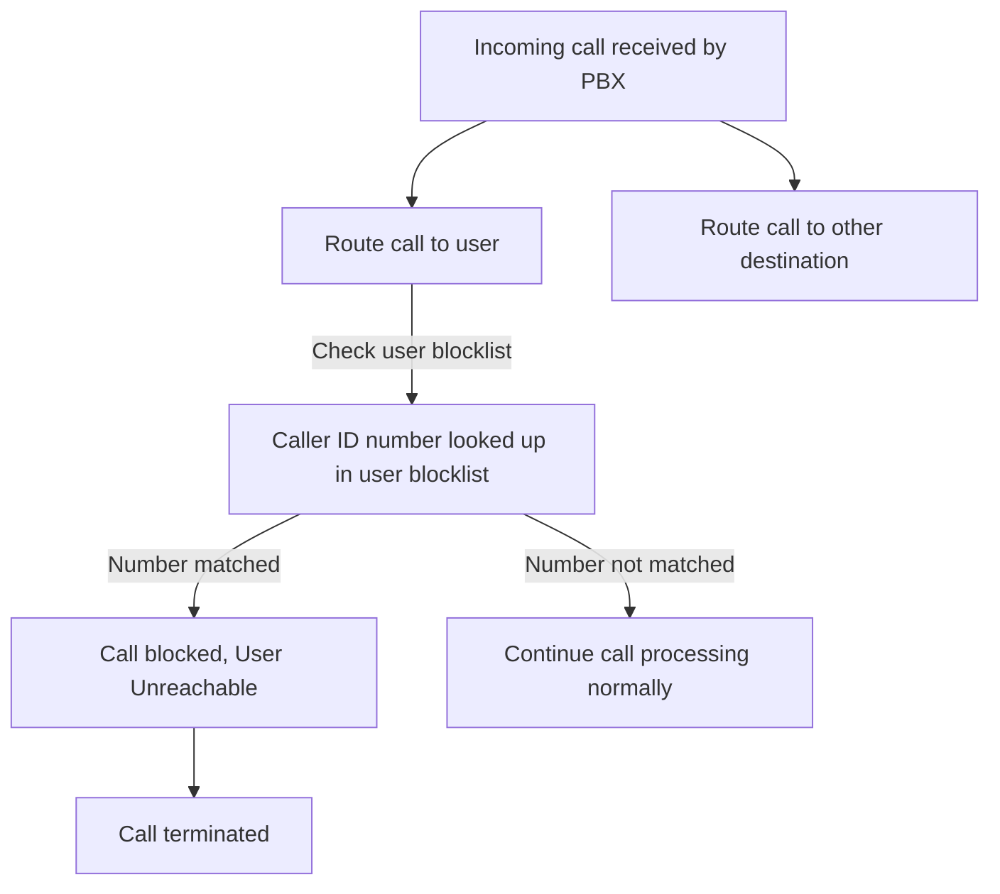

The user blocklist feature allows wazo-platform users to maintain a list of phone numbers that
should be used to screen external incoming calls and block unwanted callers, such as telemarketers,
spammers or harassers.

User blocklists are only used to screen incoming calls destined to users, and are not used to screen
_internal_ calls.

Here's a flow diagram describing how the blocklist feature impacts the call flow:

## Managing a blocklist

An end-user of Wazo Platform can manage their blocklist through the `wazo-confd` end-user APIs using
the endpoints
[`/api/confd/1.1/users/me/blocklist/*`](/documentation/api/configuration.html#tag/blocklist):

## Administrator oversight

Wazo-Platform administrator users have access to read-only APIs in wazo-confd to consult the numbers
blocklisted by users, using the endpoints
[`/api/confd/1.1/users/<uuid>/blocklist/*`](/documentation/api/configuration.html#tag/blocklist):

## Configurations affecting blocklist screening

Blocklist call screening relies on matching the Caller ID number of an incoming call with numbers in
users blocklists. Numbers specified in user blocklists are restricted to
["E.164" format](https://en.wikipedia.org/wiki/E.164) with the international prefix `+`, also known
as +E.164, e.g. `+33639981234` for a french mobile number. During blocklist screening, incoming
Caller ID numbers must be interpreted and normalized into this format in order to perform a lookup
and detect a match.

Two configurations may affect the processing of the Caller ID number and blocklist screening:

- [`in_callerid` normalization rules](/uc-doc/installation/postinstall#callerid-num-normalization):
  these normalization rules may transform an incoming Caller ID number into different formats,
  including ambiguous locale-specific formats;
- [wazo-confd tenant localization](/uc-doc/administration/localization): this API provides explicit
  per-tenant geographical context information which may be used by Wazo Platform subsystems for
  interpretation and normalization of locale-dependent information, such as phone numbers.

Both configuration elements must be consistent for blocklist screening to be reliable and avoid
false negatives or false positives.

For example, if `in_callerid` rules produce Caller ID numbers in the french national format, e.g.
`0639981234` , then the tenant's localization must be correspondingly set to France, in order for
such a number to be unambiguously interpreted.

If `in_callerid` rules are such as to produce only +E.164 Caller ID numbers, then the Caller ID
number would remain unambiguous irrespective of the tenant's localization.

## Debugging

In the presence of call issues which are suspected to be related to user blocklist screening, a few
steps may be taken to investigate and verify the impact of blocklist screening.

- Checking Asterisk logs should show whether the blocklist dialplan was invoked, and whether the
  call was blocked or not;
- Checking the `wazo-agid` logs should inform on the processing of the `screen_blocklist` AGI; in
  debug mode, the logs will show the Caller ID number being looked up, the user UUID, if the number
  is matched in the user's blocklist, and the UUID of the blocklist entry if a match was found;
- Checking the `wazo-confd` logs should inform on the usage of the blocklist APIs; in debug mode,
  the logs should show the API calls to the blocklist lookup API endpoint;
  `/users/{user_uuid}/blocklist/numbers`, and whether the lookup is a successful match (204
  response) or not (404 response);
- Using the `wazo-confd` admin APIs `/users/{user_uuid}/blocklist/numbers` or
  `/users/blocklist/numbers?user_uuid={user_uuid}` to read a user's blocklist; this should reveal
  the blocklist entries that are currently active for the user; note that the numbers in the
  blocklist are always formatted in +E.164, while an incoming Caller ID numbers may not be, and
  needs to be interpreted and normalized by the `screen_blocklist` AGI when looking it up.
