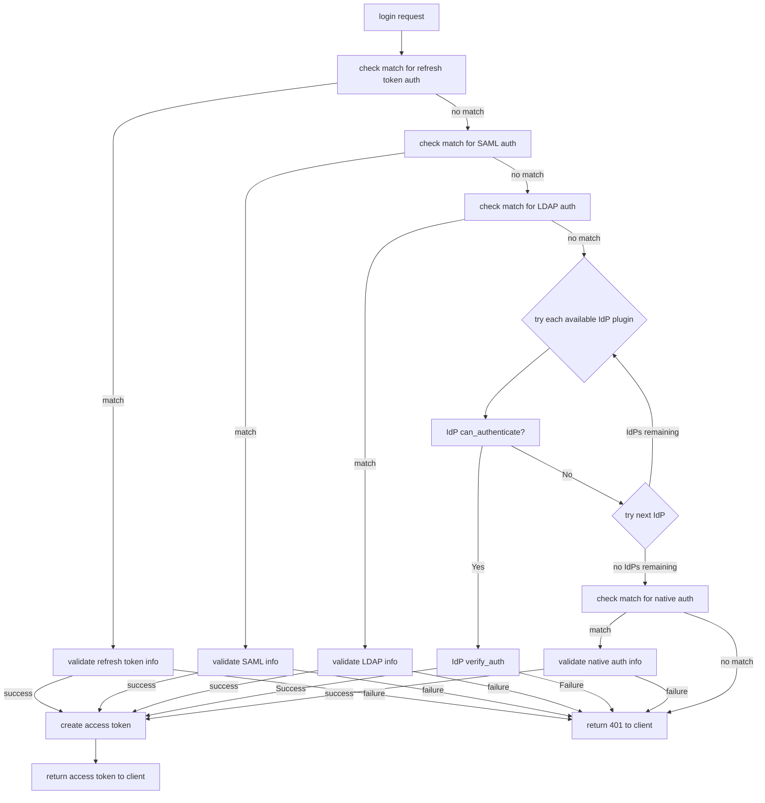
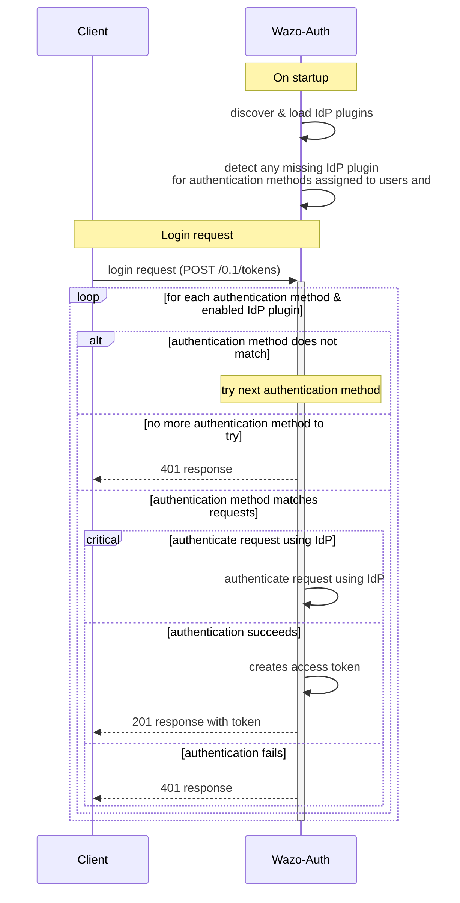
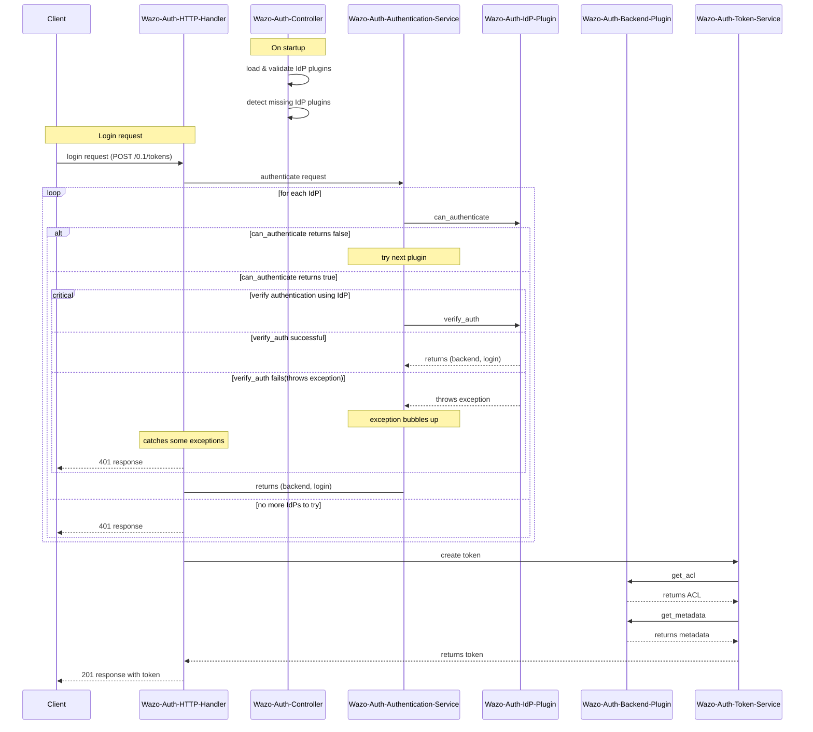

## Architecture

wazo-auth contains 3 major components, an HTTP interface, authentication backends and a storage
module. All operations are made through the HTTP interface, tokens are stored in postgres as well as
the persistence for some of the data attached to tokens. Backends are used to test if a supplied
username/password combination is valid and provide the xivo-user-uuid.

wazo-auth is made of the following modules and packages.

### backend_plugins

the plugin package contains the wazo-auth backends that are packaged with wazo-auth.

### http_plugins

The http module is the implementation of the HTTP interface.

- Validate parameters
- Calls the backend the check the user authentication
- Forward instructions to the _token_manager_
- Handle exceptions and return the appropriate status_code

### controller

The controller is the plumbing of wazo-auth, it has no business logic.

- Start the HTTP application
- Load all enabled plugins
- Instantiate the token_manager

### token

The token modules contains the business logic of wazo-auth.

- Creates and delete tokens
- Creates ACL for Wazo
- Schedule token expiration

## Plugins {#developing-plugins}

wazo-auth is meant to be easy to extend. This section describes how to add features to wazo-auth.

### Backends

wazo-auth allows its administrator to configure one or many sources of authentication. Implementing
a new kind of authentication is quite simple.

1. Create a python module implementing the
   [backend interface](https://github.com/wazo-platform/wazo-auth/blob/master/wazo_auth/interfaces.py).
2. Install the python module with an entry point `wazo_auth.backends`

An example backend implementation is available
[here](https://github.com/wazo-platform/wazo-auth-example-backend).

### External Auth

wazo-auth allows the user to enable arbitrary external authentication, store sensible information
which can be retrieved later given an appropriate ACL.

An external authentication plugin is made of the following parts.

1. A setup.py adding the plugin the `wazo_auth.http` entry point
2. A flask_restful class implementing the route for this plugin
3. A marshmallow model that can filter the stored data to be safe for unprivileged view
4. A plugin_info dictionary with information that should be displayed in UI concerning this plugin

The restful class should do the following:

- POST: This is where the plugin should setup any information with the external service and usually
  return a validation code and a validation URL to the user.
- GET: After activating the external authentication, following the POST. The GET can be used to
  retrieve credentials granting access to certain resource of the external service.
- DELETE: Should remove the stored data from wazo-auth
- PUT: (optional) Could be implemented to modify the scope of the generated credentials if the
  external service allow that kind of modification.

#### OAuth2 helpers

If the external service uses OAuth2 it is possible to use some helper functions in the external_auth
service.

Those helpers can be used to get notified when the user has accepted wazo-auth on the external
service.

The following helpers are available:

```python
external_auth_service.register_oauth2_callback(auth_type, user_uuid, state, callback, *args, **kwargs)
```

- auth_type: The name of the authentication backend
- user_uuid: The user UUID of the user creating the external auth
- state: The state returned from the authorization URL query
- callback: the callable that should be triggered when the authorization is complete
- args and kwargs: arguments that will be added to the callback arguments

When the callback function gets called, its last args will be the message sent to the redirect URL
by the external service.

**Note**: The callback is not executed in the main thread. You should take care of thread
synchronization when sharing data structures between threads.

The callback is usually used to create a first token on the external service.

```python
external_auth_service.build_oauth2_redirect_url(auth_type)
```

This helper returns a URL that can be used by the OAuth2Session to trigger a redirection and
receives a callback when the authorization is complete.

#### Example

```text
setup.py
src/plugin.py
```

```python
#!/usr/bin/env python3
from setuptools import find_packages
from setuptools import setup

setup(
    name='auth_bar',
    version='0.1',

    packages=find_packages(),
    entry_points={
        'wazo_auth.external_auth': [
            'bar = src.plugin:BarPlugin',
        ],
    }
)
```

```python
from marshmallow import Schema, fields, pre_load
from flask import request
from wazo_auth import http


class BarService(http.AuthResource):

    auth_type = 'bar'  # Should be the same as the entry point
    authorization_base_url = 'https://accounts.bar.com/oauth/v2/auth'
    token_url = 'https://accounts.bar.com/oauth/v2/token'
    client_id = 'client_id'
    client_secret = 'client_secret'

    def __init__(self, external_auth_service):
        self.external_auth_service = external_auth_service
        self.redirect_uri = self.external_auth_service.build_oauth2_redirect_url(self.auth_type)

    @http.required_acl('auth.users.{user_uuid}.external.bar.delete')
    def delete(self, user_uuid):
        # Remove all stored data for the BAR service for this user
        self.external_auth_service.delete(user_uuid, self.auth_type)
        return '', 204

    @http.required_acl('auth.users.{user_uuid}.external.bar.read')
    def get(self, user_uuid):
        # The GET retrieves all stored data from the service and return the secret that is
        # required to use the Bar service

        # The GET will also need to generate a new token if the current one has expired.
        return self.external_auth_service.get(user_uuid, self.auth_type), 200

    @http.required_acl('auth.users.{user_uuid}.external.bar.create')
    def post(self, user_uuid):
        session = OAuth2Session(self.client_id, scope=self.scope, redirect_uri=self.redirect_uri)
        # Should use the body of the POST and create a token with the Bar service
        data = request.get_json(force=True)
        authorization_url, state = session.authorization_url(
            self.authorization_base_url,
            access_type='offline',
        )
        self.external_auth_service.register_oauth2_callback(
            state,
            self.create_first_token,
            session,
            user_uuid,
       )

       return {'authorization_url': authorization_url}, 201

   def create_first_token(self, session, user_uuid, msg):
       # This callback is triggered when the user authorize wazo-auth using the authorization_url
       token_data = session.fetch_token(
           self.token_url,
           client_secret=self.client_secret['us'],
           code=msg['code'],
       )

       data = {
           'access_token': token_data['access_token'],
           'refresh_token': token_data.get('refresh_token'),
           'token_expiration': get_timestamp_expiration(token_data['expires_in'])
       }

       self.external_auth_service.update(user_uuid, self.auth_type, data)


# When GET /users/:uuid/external is called this model will be used to filter the private data
class BarSafeData(Schema):

    # Only the scope field will be returned
    scope = fields.List(fields.String)

    @pre_load
    def ensure_dict(self, data):
        return data or {}


class BarPlugin(object):

    plugin_info = {'required_acl': ['view-all-contacts', 'list-email-addresses']}

    def load(self, dependencies):
        api = dependencies['api']
        external_auth_service = dependencies['external_auth_service']
        args = (external_auth_service,)

        # If the plugin does not register a safe mode an empty dictionary will be used when doing
        # a GET /users/:uuid/external
        external_auth_service.register_safe_auth_model('bar', BarSafeData)

        api.add_resource(BarService, '/users/<uuid:user_uuid>/external/bar', resource_class_args=args)
```

### Email Notification

By default `wazo-auth` implement an email notification plugin to send email through SMTP protocol.
Implementing a new kind of email notification can be done by:

1. Create a python module implementing the
   [BaseEmailNotification](https://github.com/wazo-platform/wazo-auth/blob/master/wazo_auth/interfaces.py)
   interface.
2. Install the python module with an entry point `wazo_auth.email_notification`.
3. Add configuration to use the new `email_notification` plugin.

#### Example

```text
setup.py
src/plugin.py
/etc/wazo-auth/conf.d/email_notification.yml
```

```python
#!/usr/bin/env python3
from setuptools import find_packages, setup

setup(
    name='auth_email_notification_proxy',
    version='0.1',
    packages=find_packages(),
    entry_points={
        'wazo_auth.email_notification': [
            'proxy = src.plugin:ProxyEmail',
        ],
    }
)
```

```python
import requests

from wazo_auth.interfaces import BaseEmailNotification


class ProxyEmail(BaseEmailNotification):
    def __init__(self, config: dict, **kwargs: dict) -> None:
        self.proxy_confirmation_url = config['proxy_confirmation_url']
        self.proxy_password_reset_url = config['proxy_password_reset_url']

    def send_confirmation(self, context: dict) -> None:
        requests.post(self.proxy_confirmation_url, json=context)

    def send_password_reset(self, context: dict) -> None:
        requests.post(self.proxy_password_reset_url, json=context)
```

```yml
email_notification_plugin: proxy
proxy_confirmation_url: confirmation.example.com
proxy_password_reset_url: password_reset.example.com
```

### IdP plugins

> **Note**  
> IdP comes from an abbreviation of "Identity Provider"

The `wazo_auth.idp` entrypoint namespace is supported to register alternative authentication
mechanisms to those supported by default.

An IdP plugin can implement a specific mechanism of authentication for some login requests. This
would allow, for example, checking credentials from a login request by querying a third party API.

This plugin interface is complemental to the [`wazo_auth.backend` plugin interface](Backends), as
the authentication mechanism of an IdP must result in the selection of an appropriate
`wazo_auth.backend` implementation, along with the wazo user identity(wazo username or email
address) which is being authenticated.

- IdP plugin interface deals with authentication at a more abstract level, by leaving the plugin to
  process the login request, without imposing expectations such as the presence of a
  username/password credential; an IdP plugin authentication mechanism may rely on a
  `wazo_auth.backend` `verify_password` implementation, or not;
- `wazo_auth.backend` plugins are used both to authenticate the username/password credential of a
  login request, as well as to provide the ACLs & metadata of the generated access token; IdP
  plugins cannot affect the ACLs & metadata resulting from a successful login other than by
  selecting the appropriate `wazo_auth.backend` implementation;
- an IdP plugin can elect to handle a login request, and can choose(statically or dynamically) which
  `wazo_auth.backend` implementation to use in the authentication process; this enables new
  `wazo_auth.backend` implementations to be used without modifying the core wazo-auth code.

#### Interface

The plugin interface is defined in the wazo-auth codebase as a python class.

https://github.com/wazo-platform/wazo-auth/blob/master/wazo_auth/interfaces.py#L114-L147

```python
class IDPPluginDependencies(TypedDict, total=False):
    backends: Mapping[str, Extension]
    ...

class IDPPlugin(Protocol):
    loaded: bool = False
    """
    Indicates that the plugin has been fully loaded successfully
    (load method executed completely without errors)
    """
    authentication_method: str
    """
    identifier for this auth method
    """

    def load(self, dependencies: IDPPluginDependencies):
        """
        Perform required initialization logic,
        such as extracting dependencies into instance attributes,
        and set `self.loaded` to `True`
        """
        ...

    def can_authenticate(self, args: dict) -> bool:
        """
        Evaluate if this plugin is applicable to a login request based on login request args

        Returns true if the plugin can authenticate the login request
        based on the login request information, false otherwise.
        """
        ...

    def verify_auth(self, args: dict) -> tuple[BaseAuthenticationBackend, str]:
        """
        Verify(authenticate) login request and return an authentication backend and a login string
        """
        ...
```

- `load(self, dependencies: IDPPluginDependencies) -> None`: this method is called on an instance of
  the plugin class, once _at startup_ of the wazo-auth service;  
   this should perform any initialization logic necessary for future invocations of the other
  methods, such as acquiring resources and references to useful dependencies;  
  the `dependencies` argument is a dictionary containing other code components that may be useful to
  the plugin implementation, such as the `backends` dictionary containing the available
  `wazo_auth.backends` plugins, and service objects to interact with core wazo-auth resources such
  as users, tenants, etc;
- `can_authenticate(self, args: dict) -> bool`: this method is called from a successfully loaded
  plugin object, to evaluate if the plugin deems itself capable of authenticating the request
  described by the `args` dictionary; `args` contains various request attributes, such as the
  `login` and `password` taken from "Basic" HTTP authentication(HTTP header of the form
  `Authorization: Basic <base64(username:password)>`); the `flask.request` global proxy object may
  be imported and used for direct access to the http request, including any header and the raw
  request body, if necessary;  
  **NOTE**: it is important that the implementation of this method be efficient and performant,
  ideally only looking at request attributes, and not performing any additional API call or database
  query, as this method is called on _each enabled IdP plugin_ for _each login request_, so any
  latency incurred by this method will affect all login requests;
- `verify_auth(self, args: dict) -> tuple[BaseAuthenticationBackend, str]`: this method is called
  from a successfully loaded plugin object, for any login request for which this plugin's
  `can_authenticate` call was the first to evaluate to `True`, in order to perform any
  authentication logic required to verify if the login request is valid and deserves a successful
  response; any issue found with the login request that should prevent a successful authentication
  should raise an appropriate exception that can be interpreted into an appropriate HTTP response,
  such as `wazo_auth.exceptions.InvalidLoginRequest`;  
  on successful authentication, this method should return a tuple of two values, the first being a
  `wazo_auth.backend` instance which can be used to provide the ACLs and metadata for the access
  token that will be generated, and the second value being a login string that identifies the wazo
  user being logged in, either the wazo username or an active email address associated to the wazo
  user;
- `authentication_method`: an attribute(usually a static class attribute) that defines a string
  identifying the authentication method implemented by this IdP; this `authentication_method` may be
  associated to wazo-auth tenants and users in order to constrain tenants and users to the use of a
  specific authentication mechanism; the `authentication_method` of all IdP plugins appear as part
  of the response to a `GET /0.1/idp` request, enabling a wazo-auth client to discover the available
  authentication methods;

If an IdP plugin successfully matches and authenticates a login request, the login string returned
as the second tuple value from the call to `verify_auth` is used to verify that the corresponding
wazo-auth user is configured with the `authentication_method` implemented by the plugin. Only users
or tenants configured with the authentication method of an IdP plugin can successfully authenticate
through that IdP plugin.

> **Warning**  
> An IdP plugin can be made authoritative in authenticating any login request, which means that a
> particular IdP implementation can make or break any and all authentication to the Wazo platform
> deployment.  
> Be careful to load only trusted IdP plugins, and properly test an IdP plugin implementation before
> deploying it to a production system.

#### Example

A simple IdP plugin that authenticates requests based on a custom header(which could contain a
pre-negotiated API key, or a shared secret, or a JWT token, etc):

```python
from flask import request


class MyIDPPlugin:
    loaded False
    authentication_method = 'my_idp'

    def load(self, dependencies: IDPPluginDependencies):
        self.backend = dependencies['backends']['wazo_user']
        self.user_service = dependencies['user_service']
        self.loaded = True

    def can_authenticate(self, args: dict) -> bool:
        # any request attribute can be accessed using flask.request
        # for example to check for a custom header
        return bool(request.headers.get('X-My-IdP-Header'))

    def verify_auth(self, args: dict) -> tuple[BaseAuthenticationBackend, str]:
        auth_header = request.headers.get('X-My-IdP-Header')
        assert auth_header
        # validate header or raise exception
        info = self._verify_my_idp_header(auth_header)
        args.update(info)
        # either HTTP basic auth is used with this method, and `login` comes from the basic auth username
        # else the plugin must obtain a `login` value corresponding to the wazo username or registered email address
        return self.backend, args['login']

    def _verify_my_idp_header(self, header: str) -> dict:
        # may perform a database lookup for a user matching the header
        # or decode the header into something that can identify the user
        # or call out an external API service to validate the header
        # and identify the user
        ...
        return user_info
```

#### Diagrams

A flow chart describing the authentication process in the presence of IdP plugins:



A high-level sequence diagram describing the authentication process in the presence of IdP plugins:



A more focused diagram on the details of the authentication mechanism


